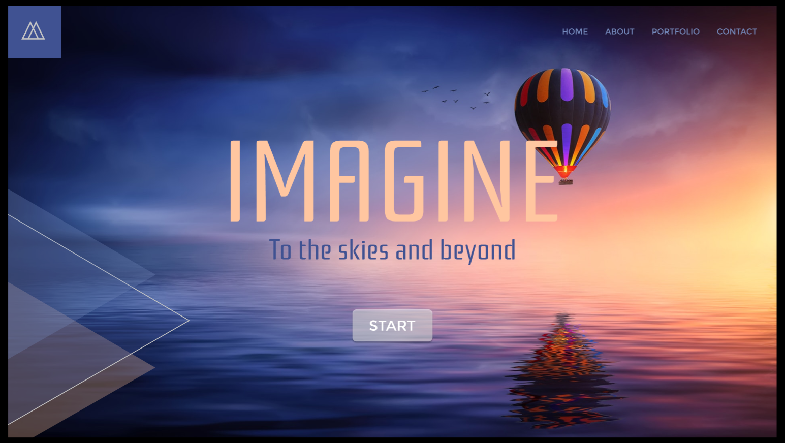
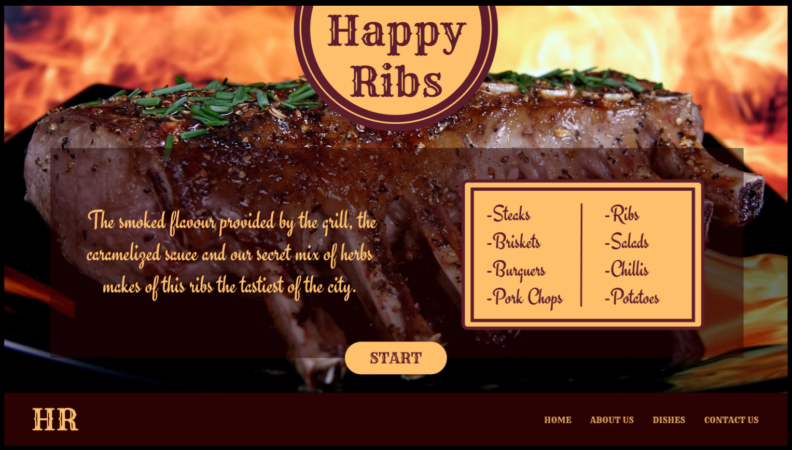

# UI/UX DESIGN PORTFOLIO

# Recursos
- Figma
- Pixabay
- Pexels
- Photoshop

# IMAGINE

* Ver en línea:
https://www.figma.com/proto/lDhrvI7cuNw7YyZob30Qyr/imagine-fb?node-id=1%3A2&viewport=401%2C358%2C0.5218750238418579&scaling=contain

# TECHNIUM

* Ver en línea:
https://www.figma.com/proto/70qVT0NosYfsBHNn9GqnSh/technium-fb?node-id=1%3A2&viewport=401%2C358%2C0.5218750238418579&scaling=contain

# HAPPY RIBS

* Ver en línea:
https://www.figma.com/proto/HzjVmHxechro0F60YIdnmq/happyRibs-FB?node-id=1%3A2&viewport=430%2C344%2C0.5218750238418579&scaling=contain

